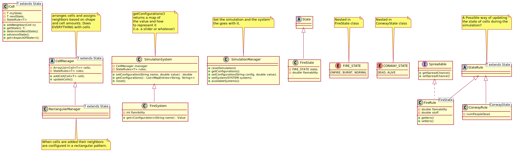
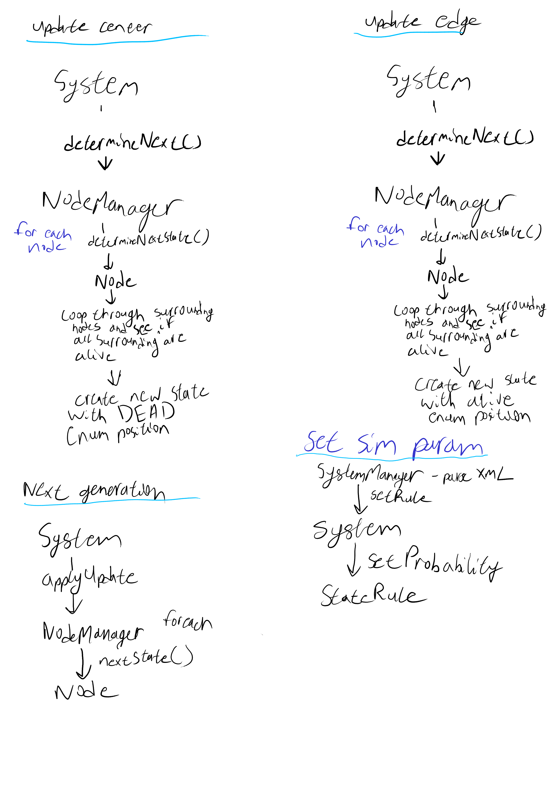
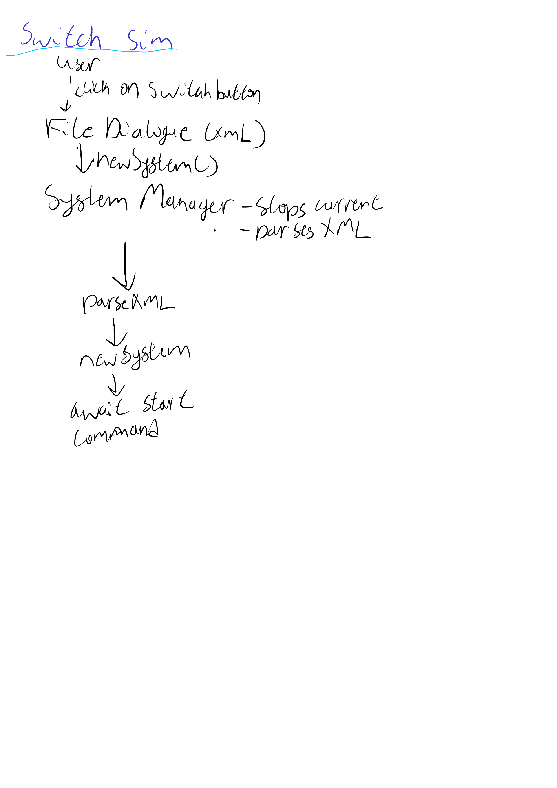
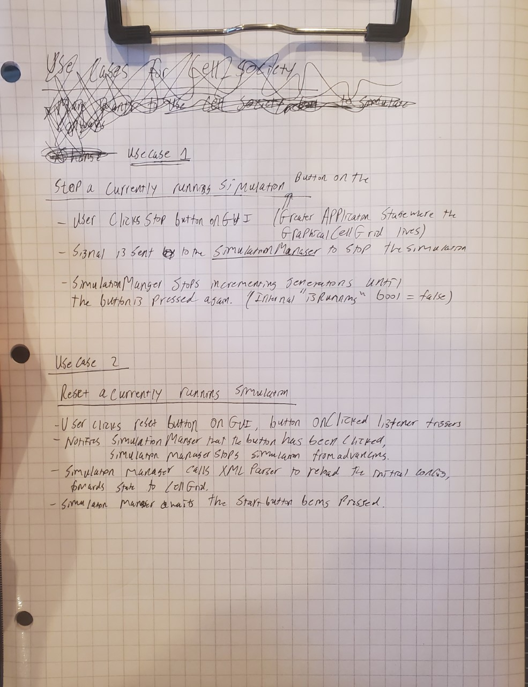
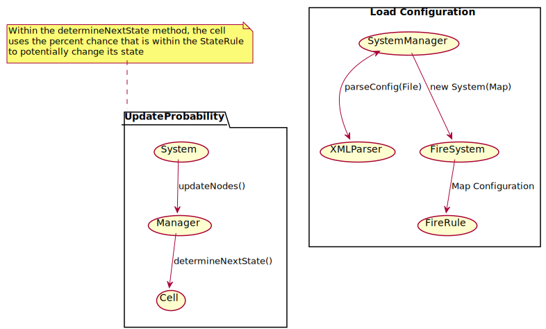

# Cell Society Design Plan

### Team Number 02

### Names

- Marc Chmielewski (msc68)
- Joshua Petitma (jmp157)
- David Coffman (djc70)

#### Examples

Segregation: class abstraction that represents the Cell that's within the system. API that when
dragged and dropped on each other triggers a swap

Here is a graphical look at my design:



Yes, it's small sorry, right click and select view image pls!

## Introduction

Cellular automata (CA) are a powerful way of modelling both trivial and impactful systems that we
experience on a day-to-day basis. As such, a system that allows us to model CA would be a great
asset to both academic and entertainment pursuits. Cell Societies is a way to model these CA in a
general sense, that upon its final implementation should be able to model any CA, within reason,
that we throw at it.

In general, we have opted to take a modular design approach, that is, the design is generally open
and extensible, but the internal state and behavior is generally closed an encapsulated. We have
also attempted to implement the model, view, controller (MVC) design pattern, as that allows us to
keep functionality relatively separate, and as such keep our code DRY and SHY.

## Overview

### Implementation 1: The One We're Going For

***

* The program is implemented with a modular approach to maximize the amount of interoperability
  within the code.
* The roles within the code are delegated as follows:
    * **Model**
        * Cells:
            * Cells are the fundamental unit of the simulation.
            * Cells keep track of their own state
            * Cells keep a list of their neighboring cells
                * Cells can check neighbors state (checkNeighbors())
        * CellGrid:
            * Controls the rules of the game
            * Keeps a reference to each Cell (2D ArrayList?)
            * Tells the Cells to update state (compute)
            * Tells the Cells to move to next "frame" of the Simulation (commit)

    * **View**
        * GraphicalCell:
            * Has a Color
        * GraphicalCellGrid:
            * Stores all the GraphicalCells
        * Miscellaneous Other Accoutrements:
            * FilePicker/Dialogue
            * Output Text when simulation finishes (if simulation is terminable)

    * **Controller**
        * SimulationManager:
            * Has an XMLParser to create new CellGrids
            * Manages existing CellGrids (in memory)
                * Creates and discards CellGrids
                * Tells current CellGrid when to stop and start
            * Keep tabs on what Color maps to what State, presumably with some sort of Map, and
              facilitate communications between the Model and View layers.
        * XMLParser:
            * Does what it says on the tin
            * Creates new Simulations, by parsing XML and passing that off to the SimulationManager
            * States and rules are governed by the `<Type>` field

### Implementation 2: The "Efficient" Approach *(AKA: A Poor Life Decision)*

***

* **Model/Controller**
    * CellGrid:
        * 2D int array of "states"
            * Controls the rules of the game
            * Updates 2D states directly for both current and next frame
            * Passes graphical information to GraphicalCell
* **View**
    * GraphicalCell:
        * Has a Color
        * GraphicalCellGrid:
        * Stores all the GraphicalCells
        * Miscellaneous Other Accoutrements:
        * FilePicker/Dialogue
        * Output Text when simulation finishes (if simulation is terminable)

## User Interface

* Select Configuration Button (launches FileDialogue)
* Start Button, transforms to Reset after pressed
* Display box (Where events happen)
    * Title of simulation
    * Grid where the simulation is occurring

## Configuration File Format

### Example 1: Fire Spreading

***

```xml

<System>
  <Type>Probability</Type>
  <Name>Fire System</Name>
  <GeometricConfiguration>
    <Pattern>Rectangular</Pattern>
    <Height>30</Width>
    <Width>30</Width>
  </GeometricConfiguration>
  <SimulationParameters>
    <Probability>.025</Probability>
  </SimulationParameters>
</System>
```

### Example 2: Conway's Game of Life

***

```xml

<System>
  <Type>Cyclic</Type>
  <Name>Conway's Game of Life</Name>
  <GeometricConfiguration>
    <Pattern>Rectangular</Pattern>
    <Height>50</Width>
    <Width>50</Width>
  </GeometricConfiguration>
  <SimulationParameters>
    <AliveNumberMin>2</AliveNumberMin>
    <AliveNumberMax>3</AliveNumberMax>
    <SpawnNumberMin>3</SpawnNumberMin>
    <SpawnNumberMax>3</SpawnNumberMax>
  </SimulationParameters>
</System>
```

## Design Details

The roles within the code are delegated as follows:

* Cells:
    * Cells are the fundamental unit of the simulation.
    * Cells keep track of their own state
    * Cells keep a list of their neighboring cells
    * Cells can check neighbors state (checkNeighbors())

* CellGrid:
    * Controls the rules of the game
    * Keeps a reference to each Cell (2D ArrayList?)
    * Tells the Cells to update state (compute)
    * Tells the Cells to move to next "frame" of the Simulation (commit)

* GraphicalCell:
    * Has a Color

* GraphicalCellGrid:
    * Stores all the GraphicalCells

* Miscellaneous Other Accoutrements:
    * FilePicker/Dialogue
    * Output Text when simulation finishes (if simulation is terminable)


* SimulationManager:
    * Has an XMLParser to create new CellGrids
    * Manages existing CellGrids (in memory)
        * Creates and discards CellGrids
        * Tells current CellGrid when to stop and start
    * Keep tabs on what Color maps to what State, presumably with some sort of Map, and facilitate
      communications between the Model and View layers.

* XMLParser:
    * Does what it says on the tin
    * Creates new Simulations, by parsing XML and passing that off to the SimulationManager
    * States and rules are governed by the `<Type>` field

## Design Considerations

* Cells:
    * Cells keep track of their own state
        * Pros:
            * Keeps the code DRY, SHY, and encapsulated
        * Cons:
            * Requires more communication, which means a bit of overhead
    * Cells that can check neighbor's state vs an integer grid
        * Pros:
            * Abstracted and encapsulated.
            * Much more generic/flexible
        * Cons:
            * A bit more overhead
            * Not SHY

* CellGrid:
    * Keeps a reference to each Cell
        * Pros:
            * Abstraction
            * Less messy in general
        * Cons:
            * More memory, more layers
            * Risk of lasagna code

* SimulationManager:
    * Manages existing CellGrids (in memory)
        * Pros:
            * Allows for "hot-swapping" of CellGrids ==> Can swap out simulations
            * Provides a unified control infrastructure (arbitrary stop/start)
            * Cleaner overall architecture
        * Cons:
            * More code, more memory, more stuff to debug

* XML Format:
    * Where to put state? ==> In the Java, not the XML
        * Pros:
            * Much easier to encode, and we probably only have a finite number of "state-patterns"
              anyways.
            * Cleaner config files
        * Cons:
            * Less "innately-modular"
            * Requires more coding overhead to add rulesets that don't fit within our archetypes

## Team Responsibilities

* Marc Chmielewski
    * Primary: Managing rules and interaction
    * Secondary: Stat/Cells and the interaction thereof
* Joshua Petitma
    * Primary: State/Cells and the interaction thereof
    * Secondary: GUI/XML
* David Coffman
    * Primary: GUI/XML
    * Secondary: Managing rules and interaction

### Use Cases

General:



* Marc Chmielewski



* Joshua Petitma



#### Cell State Swapping (David)
- In the Segregation CA, cells swap states with each other.
- After a cell determines that it needs to be swapped:
  - The `Cell` calls `CellManager::requestSwapWithCellInState`, providing the "empty" state as a parameter.
  - The body of `CellManager::requestSwapWithCellInState` finds a `Cell` with the "empty" state (in its maintained list) and returns it
  - The `Cell` then calls `Cell::swapState` on the "empty" `Cell`, swapping the cells' instance `State` objects such that the previously occupied `Cell` is now in an "empty" state and the previously empty `Cell` is now in an occupied state.

#### Neighbor Relationships (David)
- In a hypothetical version of the Percolation CA that obeys gravity, cells would "care" about the *relationship* of their neigbors to themselves; water would not percolate upwar, but could percolate sideways or downwards.
- Alternatively, neighbor relationships are also relevant to the 256 ["elementary cellular automata"](https://mathworld.wolfram.com/CellularAutomaton.html).
- In either case, cells would need to know whether a neighbor was its "top," "bottom," "left," "right," or other type of neighbor.
- To determine state updates based in a simulation where relationships are important:
  - A cell receives a `Cell::calculate` call.
  - The cell then examines its neighbors as appropriate to the specific simulation rule. In the gravity percolation example, the `Cell` would then call `Cell::getPublicState` on each of the `left`, `right`, and `top` neighbors, perform a logical `||` on those neighbors, and set its own state accordingly.
    - These relationships (`left`, `right`, and `top`) would be defined in the `Cell`'s `Map<String, Cell>` and could be retrieved with a call like `neighbors.get("top");` or some similar `enum`-based retrieval method.
