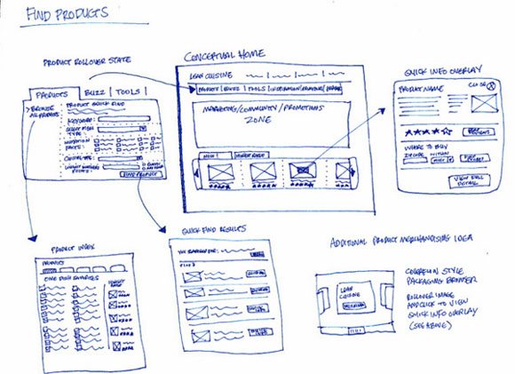

# Cell Society Design Plan

### Team Number

### Names

#### Examples

Segregation: class abstraction that represents the node that's within the system.
API that when dragged and dropped on each other triggers a swap

Here is a graphical look at my design:


made from [a tool that generates UML from existing code](http://staruml.io/).

Here is our amazing UI:



taken from [Brilliant Examples of Sketched UI Wireframes and Mock-Ups](https://onextrapixel.com/40-brilliant-examples-of-sketched-ui-wireframes-and-mock-ups/).

## Overview

## User Interface

*   Select Configuration Button (launches FileDialgue)
*   Start Button, transforms to Reset after pressed
*   Display box (Where events happen)

## Configuration File Format

```xml
<System>
	<Type>Probability</Type>
	<Name>Fire System</Name>
	<GeometricConfiguration>
		<Pattern>Rectangular</Pattern>
		<Height>500</Width>
		<Width>500</Width>
	</GeometricConfiguration>
	<SimulationParameters>
		<Probability>.025</Probability>
	</SimulationParameters>
</System>
```

## Design Details


## Design Considerations

*   Considered Having Specific Rule Classes for each individual
    System type.
*   Considered "Ultimate Rules" class that contained all the rules
    and classes used which fields they wanted to.

## Team Responsibilities

*   Team Member #1

*   Team Member #2

*   Team Member #3
